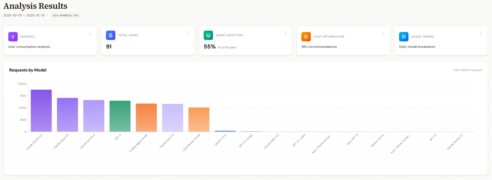
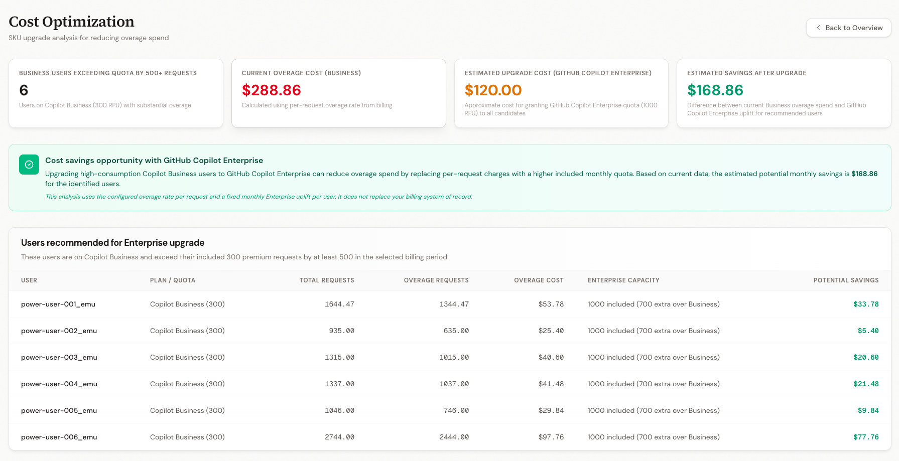
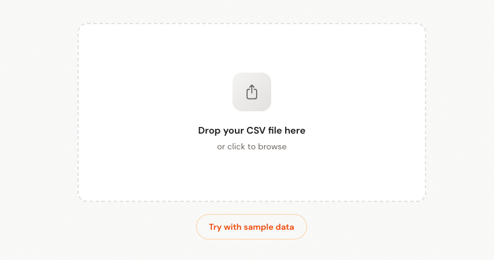

# GitHub Copilot Premium Requests Viewer

Analyze CSV exports from GitHub Copilot usage reports. See per-user consumption, quota tracking, model breakdowns, and cost optimization — all processed locally in your browser.





## Cost Optimization



## Live Demo

Try the Sample Data option on the upload screen to see how it works without needing to upload your own report.

**Live App:** https://gh.io/pru-view



## Quick Start
1. Clone & install: `git clone ... && npm install`
2. Run: `npm run dev`
3. Open http://localhost:3000 and drag in your CSV


## Supported CSV Format

This application supports the GitHub Copilot expanded billing export format.

### CSV Format
```csv
date,username,product,sku,model,quantity,unit_type,applied_cost_per_quantity,gross_amount,discount_amount,net_amount,exceeds_quota,total_monthly_quota,organization,cost_center_name
2025-10-01,alice,copilot,copilot_premium_request,Claude Sonnet 4,3.6,requests,0.04,0.144,0,0.144,False,1000,org-alpha,CC-Alpha
```

**Minimum required columns:**
- `date` (YYYY-MM-DD UTC day; internally normalized to midnight UTC)
- `username`
- `model`
- `quantity`

**Optional billing & organizational columns** (auto-detected when present):
- `applied_cost_per_quantity`, `gross_amount`, `discount_amount`, `net_amount`
- `exceeds_quota`, `total_monthly_quota`
- `product`, `sku`, `organization`, `cost_center_name`
## What You Get
- Per-user request breakdown with quota status
- Model usage distribution charts
- Overage cost calculations (Business: 300/mo, Enterprise: 1000/mo)
- Daily/weekly usage trends

 **How to get this report**:

Expanded billing export from Copilot spending or enterprise usage dashboards. Refer to the official [GitHub Copilot usage and entitlements documentation](https://docs.github.com/en/enterprise-cloud@latest/copilot/managing-copilot/monitoring-usage-and-entitlements/monitoring-your-copilot-usage-and-entitlements).

## Privacy
All processing is client-side. No data leaves your browser.

## Contributing

Contributions are welcome! This is an open-source project designed to help teams analyze their Copilot usage effectively.

1. Fork the repository
2. Create a feature branch
3. Make your changes
4. Submit a pull request


---

**Note**: This tool is not affiliated with GitHub. It's a community-created utility for analyzing Copilot usage reports.
