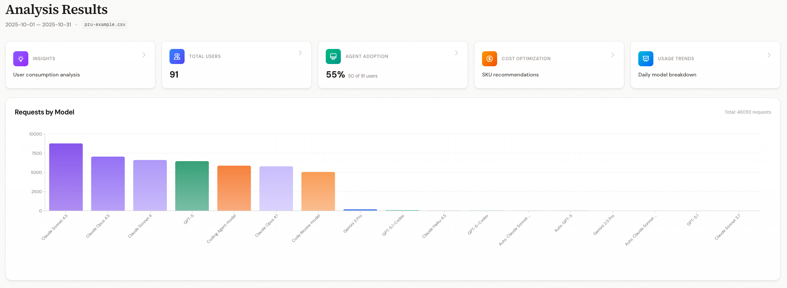
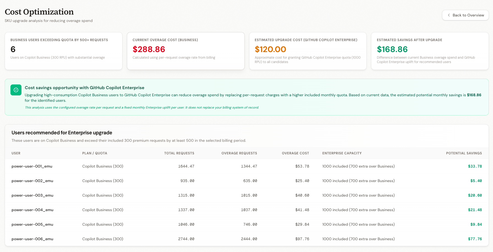
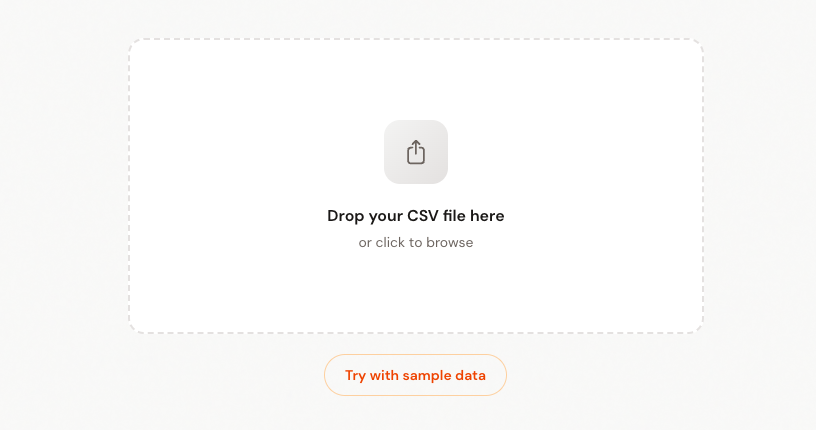

# Copilot Billing Report Viewer

Analyze CSV exports from GitHub Copilot usage reports. See per-user consumption, quota tracking, model breakdowns, and cost optimization — all processed locally in your browser.





## Cost Optimization



## Live Demo

Try the Sample Data option on the upload screen to see how it works without needing to upload your own report.

**Live App:** https://gh.io/pru-view



## Quick Start
1. Clone & install: `git clone ... && npm install`
2. Run: `npm run dev`
3. Open http://localhost:3000 and drag in your CSV


## Supported CSV Format

This application supports the GitHub Copilot expanded billing export format.

### CSV Format
```csv
date,username,product,sku,model,quantity,unit_type,applied_cost_per_quantity,gross_amount,discount_amount,net_amount,exceeds_quota,total_monthly_quota,organization,cost_center_name
2025-10-01,alice,copilot,copilot_premium_request,Claude Sonnet 4,3.6,requests,0.04,0.144,0,0.144,False,1000,org-alpha,CC-Alpha
```

**Minimum required columns:**
- `date` (YYYY-MM-DD UTC day; internally normalized to midnight UTC)
- `username`
- `model`
- `quantity`

**Optional billing & organizational columns** (auto-detected when present):
- `applied_cost_per_quantity`, `gross_amount`, `discount_amount`, `net_amount`
- `exceeds_quota`, `total_monthly_quota`
- `product`, `sku`, `organization`, `cost_center_name`

**Optional token columns** (auto-detected when present):
- `input`, `output`, `cache_read`, `cache_write`

All token fields are optional, so legacy reports remain fully operational. Blank or malformed token cells do not reject an otherwise valid row, and an unavailable value remains distinguishable from a reported `0`.

### Token views

When token fields are present, the **Models** dashboard shows a token summary with total tokens and the four fields: input tokens, output tokens, cache-read tokens, and cache-write tokens. Its per-model table is ordered by total tokens and shows each token type as a count with its share of that model's total in brackets.

The **Models** dashboard also includes a UTC daily token chart with a local model selector. Dates remain in UTC and are never converted to local time. When token fields are present, the **AI Usage** dashboard adds them to the Top Spend Drivers table for per-user context.

Token values are reported by the export. The total is the sum of the four reported fields and is used only to calculate each field's share for that model. Token values are not used to reconstruct or infer billing, cost, savings, or allocation.

## What You Get
- Per-user request breakdown with quota status
- Model usage distribution charts
- Overage cost calculations (Business: 300/mo, Enterprise: 1000/mo)
- Daily/weekly usage trends

 **How to get this report**:

Expanded billing export from Copilot spending or enterprise usage dashboards. Refer to the official [GitHub Copilot usage and entitlements documentation](https://docs.github.com/en/enterprise-cloud@latest/copilot/managing-copilot/monitoring-usage-and-entitlements/monitoring-your-copilot-usage-and-entitlements).

## Privacy
All processing is client-side. No data leaves your browser.

## Contributing

Contributions are welcome! This is an open-source project designed to help teams analyze their Copilot usage effectively.

1. Fork the repository
2. Create a feature branch
3. Make your changes
4. Submit a pull request


---

**Note**: This tool is not affiliated with GitHub. It's a community-created utility for analyzing Copilot usage reports.
